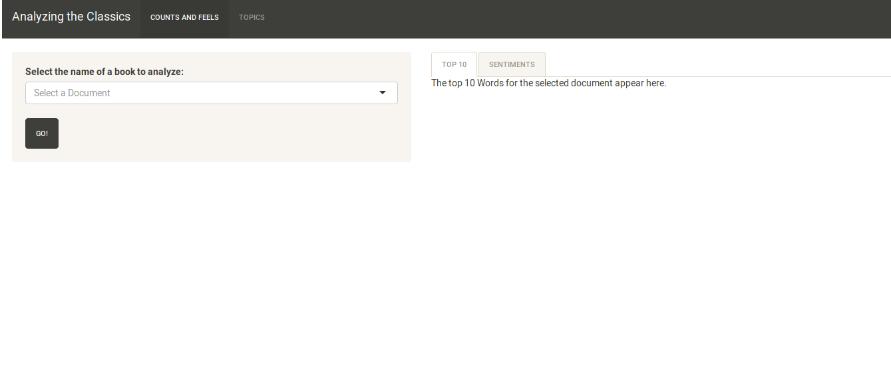
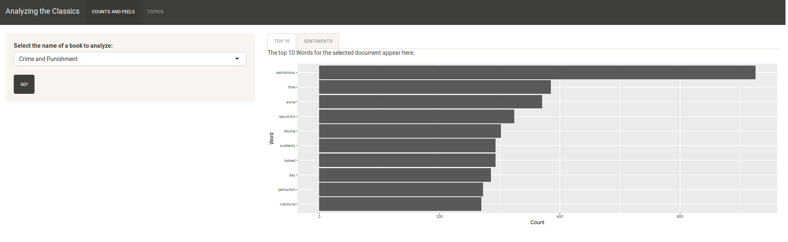
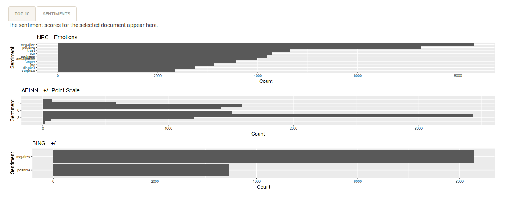
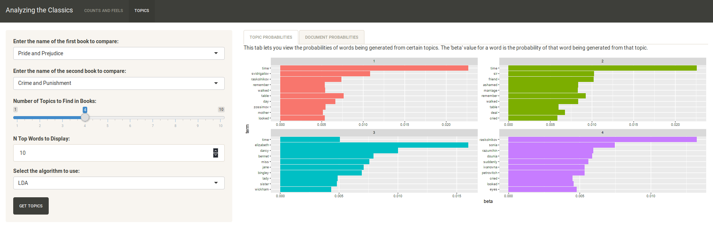
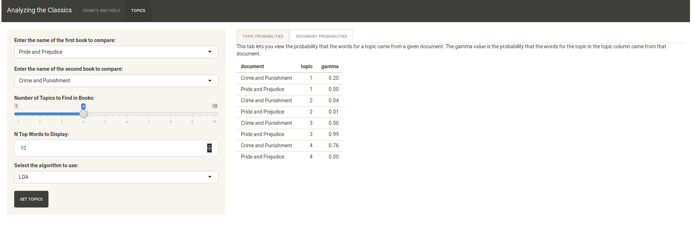

# Worditize

Worditize is a Shiny application allowing users to explore and compare documents available on 
[Project Gutenberg](https://www.gutenberg.org/) by performing basic text mining tasks in the 
browser. This application is powered by the wonderful [tidytext](https://www.tidytextmining.com/) 
and [gutenbergr](https://github.com/ropensci/gutenbergr) packages, as well as the ever-helpful 
[tidyverse](https://www.tidyverse.org/) group of packages.

### Getting Started

Upon running the application, the user is presented with the main page below:

### Counts and Sentiments

In the text box on the left, the user may begin typing the title of a public domain document that 
is available in Project Gutenberg. The first 10 matching results will be displayed in a dropdown 
menu. Doing so from the default tab "Topics and Feels" will generate the top 10 most common words 
in the text --- excluding stop words (e.g. 'a', 'an', 'the', 'but', 'and', etc.) --- as well as 
generating sentiment information, as shown in the images below.

The sentiment tab shows sentiment data for the three sentiment corpora available in the `tidytext` 
package. The NRC corpus associates emotion words with various emotive words. The AFINN corpus rates 
words on a point scale, indicating not only positivity and negativity, but als to what degree a 
word is positive or negative. Finally, the BING corpus simply rates words as "positive" or "negative".

In each case, the application generates counts for what each respective corpus measures.

### Topic Modeling (In Progress)

To this point, the topic modeling part of the application (under the "Topics" header) employs the 
`topicmodels` package, which makes handy use of tidily-formatted text data to generate a Latent 
Dirichlet Analysis (LDA) topic model. An option is available to select Pachinko topic modeling as 
well, but this is currently not implemented.

At present, two topics at a time can be mined for topics. The user is permitted to select between 
one and ten topics (default: 5) to generate. Additionally, an arbitrary number of words to show for 
each topic can be selected. As shown below, running the analysis will generate a faceted chart of 
the top N words for each topic charted against the probability of each word being generated for that 
topic.

On the "Document Probabilities" tab, we can see the probability that a word for a topic came from a 
given document, as shown by the `gamma` value.

### Future Work

I would like to make additional topic modeling algorithms available, likely by way of the 
[RMallet](https://github.com/mimno/RMallet) package, which provides an R interface to the 
`mallet` library written in Java.

### Link

Try me out at [shinyapps.io](https://progdrum.shinyapps.io/worditize/)!
